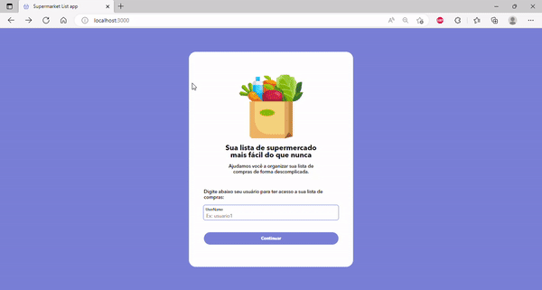

<h1 align="center">📃 Supermarket List App </h1>

<p align="center">
Organize your supermarket list more easily.
</p>

<br>

<p align="center">
  
</p>

<br>

## 🖵 Live application

https://supermarket-list-frontend-rho.vercel.app/

## 🚀 Technologies Used

This project was developed with the following technologies:

- HTML e CSS
- React.js
- Axios
- Git e Github

## 💻 Project

The main objective of the project is to organize your supermarket list more conveniently when preparing your grocery list. It has as its functionality to add, update and delete the items, also being able to check after the purchase of the product facilitating the use. This data is saved in the api.

## 🔖 Layout

You can view the project layout through [THIS LINK](https://www.figma.com/file/2sh9344fi7ioccRrFOqT6i/Lista-Supermercado?node-id=4%3A196&t=0jpoLZkNCyyvjpdo-0). You must have an account at [Figma](https://figma.com) to access it.

## ⚙️ Running Instructions

1. Clone the project:

```
 git clone https://github.com/AndrePort/supermarket-list-frontend.git
```

2. Install the dependecies:

```
 cd supermarket-list-frontend && npm install
```

3. Run the project:

```
 npm start
```

4. (Optional) If you want build a production version:

```
npm build
```
